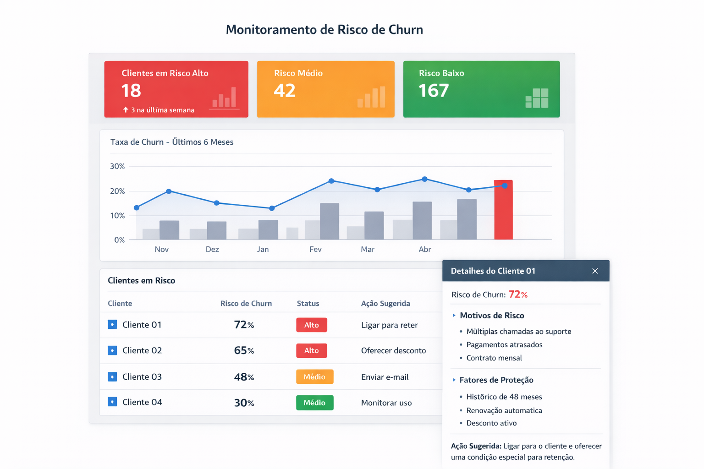

# Landing Page — Validação de Churn em ISPs

Esta landing page foi criada para **validar o problema de churn em provedores de internet (ISPs)** e capturar interesse inicial em uma futura solução de monitoramento e prevenção de cancelamentos.

O foco não é venda, mas sim **validação de dor real**, entendimento do problema e formação de uma **lista de interessados** para testes futuros (MVP).

---

## 🎯 Objetivo
- Comunicar claramente o problema de churn em ISPs
- Apresentar a proposta de valor de forma simples
- Capturar contatos de provedores interessados
- Servir como base para entrevistas e validação de mercado

---

## 🧩 O que contém
- Página estática em **HTML + CSS**
- Copy focada em dor real e tomada de decisão
- Formulário integrado ao **Google Forms**
- Mockup ilustrativo de dashboard executivo

---

## 🖼️ Mockup de Interface (conceitual)

> Mockup ilustrativo — produto em fase de validação.

---

## 🚀 Status do Projeto
Projeto em fase de **validação de problema e interesse**, ainda sem MVP funcional.

---

## 📌 Próximos Passos
- Ajustes de copy com base nas entrevistas
- Validação de funcionalidades prioritárias
- Desenvolvimento do MVP
